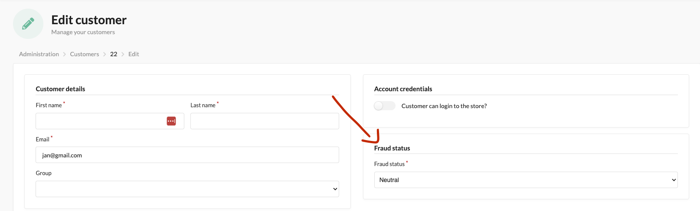
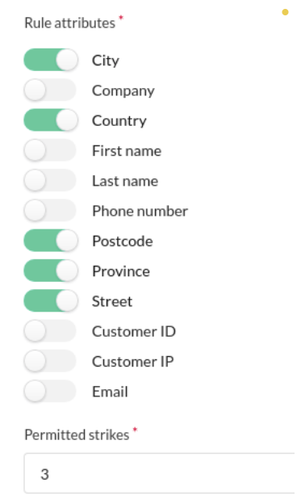
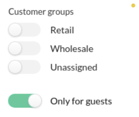
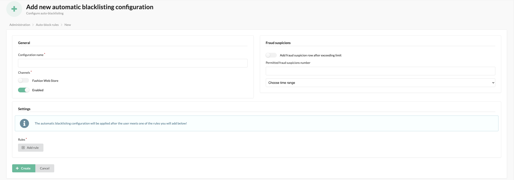
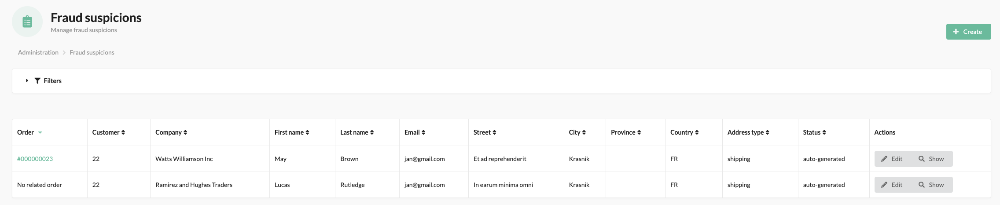
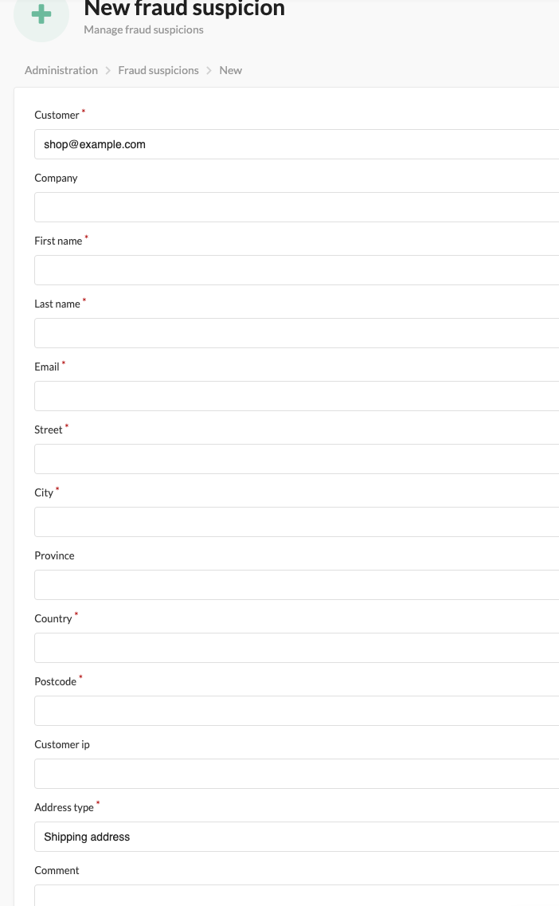

# Functionalities

---

# About Blacklist plugin

---
A plugin designed to counteract suspicious behavior by blocking purchases using automated rules or manual customer behavior analysis.

Customers are divided into three types:

- blacklisted → blocked, cannot make purchases
- whitelisted → trusted, not checked by the plugin during purchases
- neutral → regular customer who can make purchases and is checked by the plugin with every order

The customer's status can be changed manually in the customer edit panel or automatically using plugin functionalities.

# Manual blacklisting rule

---
Blocking users can be done by creating rules manually:

Manual blacklisting rules allow blocking orders where selected data repeats a certain number of times, such as shipping details.

If someone places 3 orders to the same address and tries to place a 4th, 
the system will block it because the same address details have repeated 4 times.
(If multiple attributes are selected, ALL of them must repeat for the order to be counted as a strike).
Additionally, the user MUST already be on the Fraud Suspicion list.

These rules can be applied to specific groups of customers, such as only for guest users.

If an order meets the given criteria, it will not be processed, and the user will be blocked.

# Automatic blacklisting rule

---

Blocking users can also be done using automatic rules (auto-blacklisting-config):

- If a user places x orders within a certain period, they will be blocked.
- If a user makes x failed payment attempts within a certain period, they will be blocked.

Additionally, in automatic rules, we can specify:

- After the time limit specified in the rule expires, the user will be unblocked.
- The number of rule uses after which the user/order will be added to the list of suspected frauds.

# Fraud suspicion list

---

It is a list of orders that have been flagged as suspicious by automatic rules 
(if the corresponding option was selected in the automatic rule) or manually added by the administrator. 

Based on this list of suspicious frauds, we can decide,  
that a particular user appears too frequently within a short period and should have their account blocked.
